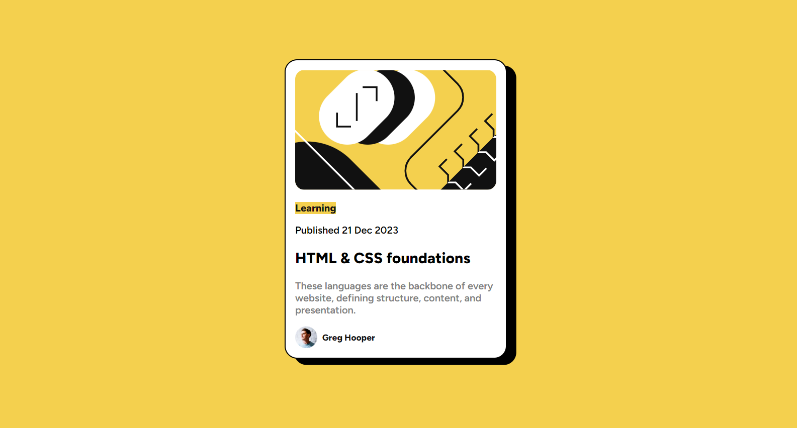
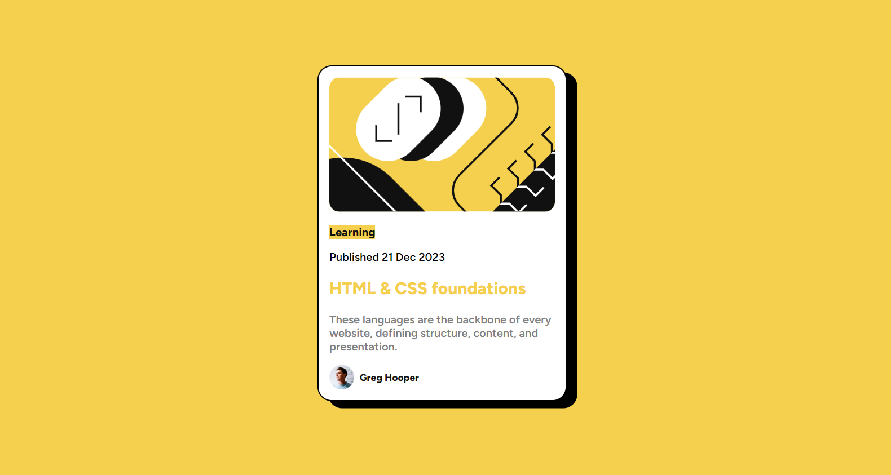

# Frontend Mentor - Blog preview card
This is a solution to the [Blog preview card challenge on Frontend Mentor](https://www.frontendmentor.io/challenges/blog-preview-card-ckPaj01IcS)

## Table of contents

- [Overview](#overview)
  - [The challenge](#the-challenge)
  - [Screenshot](#screenshot)
  - [Links](#links)
- [My process](#my-process)
  - [Built with](#built-with)
  - [What I learned](#what-i-learned)
  - [Useful resources](#useful-resources)
## Overview

### The challenge

Users should be able to:

- See hover and focus states for all interactive elements on the page

### Screenshot

- With active states

## My process

### Built with

- Semantic HTML5 markup
- CSS custom properties
- Flexbox

### Links
-Live Site URL : https://larissafiali.github.io/blog-preview-card/

##Contact 
- LinkedIn: www.linkedin.com/in/larissa-fiali-3a1a25286

